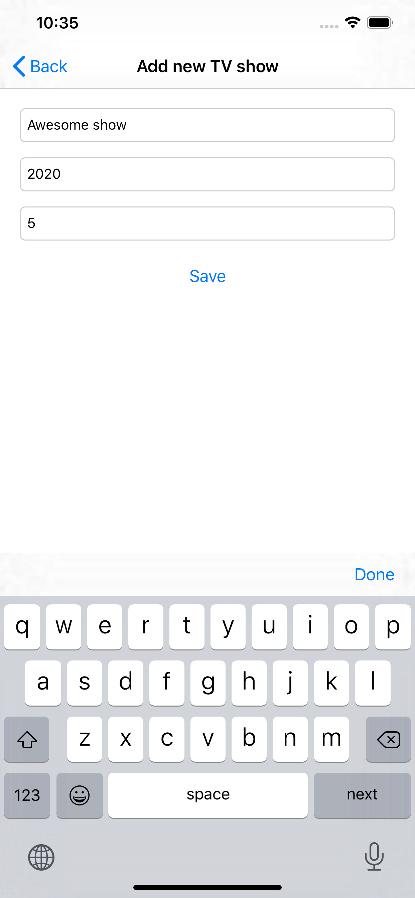
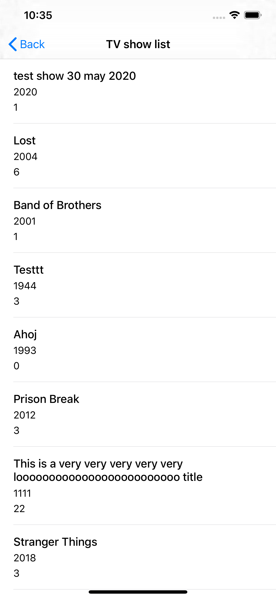

# Combyne home exercise

<center>

|Menu|Add TV Show|TV Show List|
|---|---|---|
 |  | 

</center>

### Requirements

Swift `5.0`, iOS deployment target: `13.2`.

Cocoapods `1.9.2`.

### Setup
Installed pods are included in the repository. Project runs out of the box.
In case of manual pods installation, run:

```
pod repo update
pod install
```

### Omitted features

Some features were omited to fit the timeframe:

- Localized strings
- Keyboard avoidance
- Fancy UI
- Swift libraries for dependency injection and assembly weren't used. Only familiar with `Typhoon`
- Reactive bindings
- API keys and secrets are included in codebase instead of safe fetching from external resource
- Object list fetch pagination
- Incremental table view updates
- Duplicates check on tv show creation
- Object deletion
- Progress indication during list fetch
- Offline storage